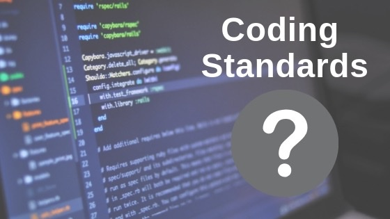

 

## First Impression
I view coding standards as a valuable and crucial aspect of software development. At the beginning of getting in touch with code, I did not entirely think this way. I had a very vivid understanding of coding standards, and thought they were just “comments” to make code readable and collaborative. This in fact is true, but was just one of the many guidelines of coding standards. 

## What Changed?
I started to realize the importance of coding standards when I was searching through past assignments to use as projects on my portfolio. Many that I examined were only worked on from a year ago, and I realized they were hard to understand. Some were missing comments, and others did not have clear sets of naming conventions or were not formatted correctly. Although I was sure that the code runs with no known problems, if they were hard to understand by the author who created them a while ago, then there clearly is an issue. I felt relieved when I found a couple of projects that were in a better form and quality, meaning that they had comments where necessary, clean and organized formatting, and etc. 

## Other Thoughts/Comments
In my perspective, coding standards are not easy to follow at first. Initially, they can feel restrictive and overwhelming since I had to change the habits that I used to have. It requires extra time and practice for it to become a good habit. When I first started to adhere to the coding standards, I felt confused and frustrated. I also often found myself lost, but in the end it all worked out. As I pushed through the discomfort, I began to see how it actually benefited me. When I look back at assignments that follow the guidelines of coding standards, they were much easier to follow. To sum up, I think it is worth taking the time to practice coding standards in that it benefits myself and possibly other collaborators. Once the environment is set up in an organized and readable manner, it makes future backtracking much more accessible. 
