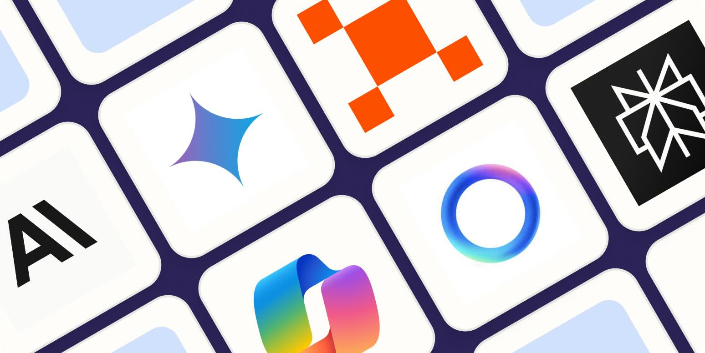

# **Introduction**
AI has become a valuable tool in education, particularly in Software Engineering, where it aids in tasks like code generation, debugging, and problem-solving. In this context, I have primarily used ChatGPT to enhance my learning experience. ChatGPT has been instrumental in providing instant guidance, explaining complex concepts, and offering solutions that support my understanding and application of Software Engineering principles.

# **Personal Experience with AI**

## **Experience WODs**
I often found myself overwhelmed by the fast-paced nature of the course, as we frequently moved on to new topics and techniques within just one or two weeks. While I initially tried to complete tasks without using AI, I often ran out of time and had to pause, watch the solution video, and then attempt the task again on my own.

## **In-class Practice WODs**
In-class practice WODs were manageable and helpful to some extent in preparing for the actual WODs. I used a mix of AI assistance and independent problem-solving, as I wanted to test my understanding of the material while also leveraging AI to fill in the gaps when needed.

## **In-class WODs**
In-class WODs were always nerve-wracking for me, and I relied on ChatGPT for most of the tasks. Without it, I often found myself completely lost. The biggest lesson I learned from using ChatGPT was how to collaborate effectively with the tool. Sometimes, it generated unwanted code or introduced errors, which required me to troubleshoot and fix them quickly before time ran out. This process taught me the importance of critically evaluating AI-generated solutions.

## **Essays**
I wrote most of the essays myself, using ChatGPT as a reference to gather information. I felt it was important to express my thoughts and reflections in my own words rather than relying heavily on AI. This approach allowed me to stay authentic while still benefiting from the additional insights AI could provide.

## **Essays**
For the final project, I relied heavily on ChatGPT because much of the material was covered at a very fast pace, making it challenging to keep up. ChatGPT was incredibly helpful in solving problems and debugging my code, allowing me to overcome obstacles and complete the project more effectively.

## **Learning a concept / tutorial**
Learning new concepts relied heavily on lecture videos for foundational understanding, supplemented by assistance from ChatGPT. This combination helped me grasp the material more effectively and provided additional support when I encountered challenges.

## **Answering a question in class or in Discord**
When answering questions in class or on Discord, I often relied on AI for assistance. It helped me formulate accurate and confident responses, especially when I was unsure about a topic.

## **Asking or answering a smart-question**
Most of my questions were answered by ChatGPT, which provided quick and helpful explanations.

## **Coding example**
For coding examples, such as “give an example of using Underscore's .pluck,” I relied on ChatGPT.

## **Explaining code**
ChatGPT handled most of the code explanations, helping me understand concepts and how they worked in practice.

## **Writing code**
Writing code relied heavily on ChatGPT for the majority of tasks, as it provided solutions and guidance throughout the process.

## **Documenting code**
Documenting code also relied on ChatGPT, as it helped me generate clear and concise explanations for the functionality and purpose of the code.

## **Quality assurance**
As mentioned earlier, I relied heavily on ChatGPT to help debug errors and explain code. It was invaluable for identifying issues and clarifying how different parts of the code worked.

## **Other uses**
To pass this class, I had to rely heavily on AI for guidance, as there was a significant amount of material to learn in a very short period. ChatGPT played a crucial role in helping me navigate through the challenges.

# **Impact on Learning and Understanding**

The incorporation of AI, particularly ChatGPT, significantly influenced my learning experience by providing quick explanations, debugging assistance, and coding examples that helped me keep up with the fast-paced course. It enhanced my comprehension by clarifying complex concepts and filled gaps in understanding when I felt lost. While relying on AI improved my problem-solving abilities and provided essential guidance, it also challenged my understanding of software engineering concepts by occasionally introducing errors that I had to troubleshoot. Overall, AI technologies were instrumental in my learning, striking a balance between support and the need for independent critical thinking.

# **Practical Applications**
Outside ICS 314, AI has practical applications in real-world projects like the Hawai'i Annual Code Challenge (HACC), where it helps generate code, debug, and brainstorm solutions. AI effectively addresses software engineering challenges by speeding up development and reducing repetitive tasks, allowing developers to focus on critical design and implementation. However, its success relies on the user’s ability to validate and adapt AI outputs to meet real-world needs.

# **Challenges and Opportunities**
One challenge I encountered with AI in the course was its tendency to produce incorrect or overly complex code, which required additional time to debug and understand. Another limitation was the risk of over-reliance, which could hinder deeper learning of the material. However, AI offers significant opportunities for further integration in software engineering education, such as personalized learning experiences, real-time feedback on code, and enhanced collaboration tools. Incorporating AI-driven simulations or adaptive learning platforms could further improve students' understanding and practical application of software engineering concepts.

# **Comparative Analysis**
Traditional teaching methods in software engineering focus on foundational knowledge and long-term retention through structured lectures and exercises. AI-enhanced approaches, like using ChatGPT, provide immediate feedback, personalized learning, and practical coding support, improving engagement and skill development. Combining both methods creates a balanced approach, leveraging the strengths of each for a more effective learning experience.

# **Future Considerations**
AI has a promising future in software engineering education, with potential to enhance personalized learning, real-time feedback, and efficiency. Challenges like ensuring accuracy and avoiding over-reliance need to be addressed. Future improvements should focus on better integration to support critical thinking and problem-solving skills.

# **Conclusion**
Using AI in the Software Engineering course was a valuable experience. It helped me understand concepts and solve problems faster, but it also highlighted the importance of critical thinking to validate AI outputs. Overall, it was a supportive tool that made learning more manageable in a fast-paced environment.
