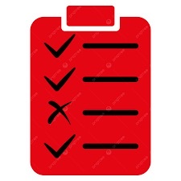

## **Summary of Project**
In this lab program, the user input is taken in first and then a menu is printed with options to analyze and edit the input. In the menu, options include finding the number of non-white space characters, number of words, finding text, and etc.

## **Role & What I learned**
I worked independently on this project. I learned a lot of other methods that were really helpful tools such as "replaceAll" and "toLowerCase()." The main method was much more cleaner with a menu method that takes care of printing the menu and calling another method upon request.


**Below is the part that shows finding the number of times a character is found:**

```Java
public static int findText(String findText, String userText) {
      userText = userText.toLowerCase();
      String[] words = userText.split(" ");
      int count = 0;

      for (int i = 0; i < words.length; i++) {
            if (words[i].equals(findText)) {
               count++;
               }
            }
         return count;
      }
```
