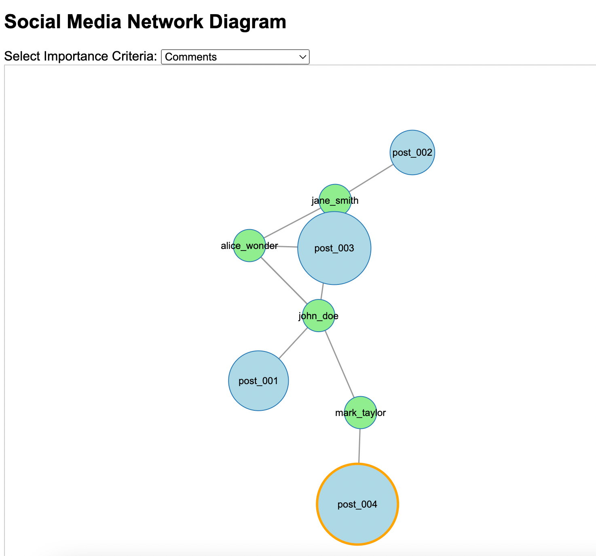
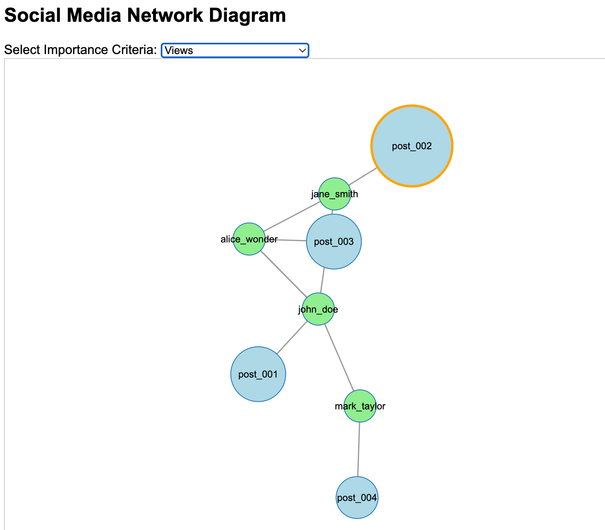
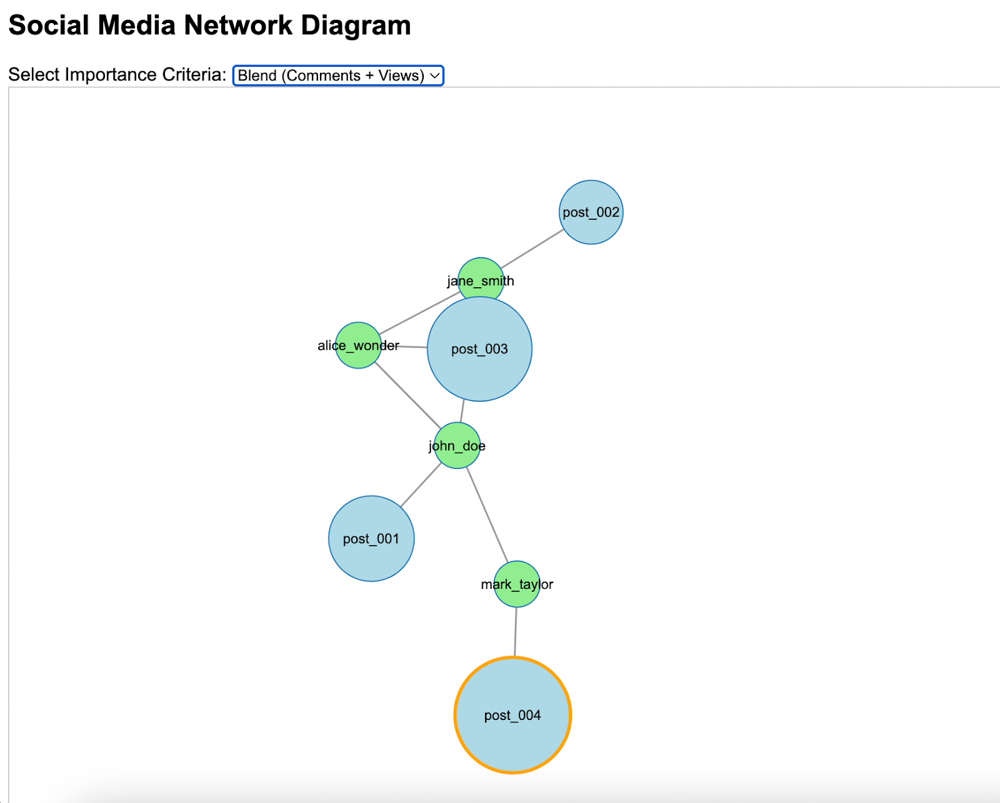

# **Summary of Project**
This is an interactive visualization tool I developed using JavaScript and D3.js. This simple tool represents a social media network where users and their posts are displayed as dynamic nodes and links. Users can select different criteria—such as comments, views, or a combined score—to highlight the most important posts. The visualization adjusts the size of each post bubble based on the chosen criteria, making it easy to identify key content quickly. While the current version is straightforward, there are many opportunities for future enhancements to improve functionality and scalability. This project is designed for small to medium-sized datasets, providing a clear and effective way to analyze social media interactions.

 

# **My Role**
I was solely responsible for creating the 2-D/3-D Diagram Highlighting Important Posts. Using the dataset provided by my group partner, I utilized JavaScript and D3.js to build an interactive network visualization. I developed features like dynamic resizing of post bubbles based on user-selected criteria and implemented a dropdown menu for selecting importance metrics. Additionally, I handled the layout and organization of the network to ensure it was easy to understand and navigate. This was my first time working with D3.js, which presented new challenges and learning opportunities.

 

# **What I Learned**
Through this project, I enhanced my skills in JavaScript and D3.js, particularly in creating interactive and dynamic data visualizations. I gained a deeper understanding of algorithm design and how to optimize performance for visual tools. I also learned how to effectively transform raw data into meaningful visual representations. Additionally, I improved my problem-solving abilities by addressing challenges related to data organization and user interaction. This experience taught me the importance of creating user-friendly interfaces and the considerations needed for scaling visualizations to handle larger datasets. Although this was my first project using these technologies, I am eager to continue learning and implement more advanced features in the future.

 

# **Visualization**
## Filter By Comments

 

## Filter By Views

 

## Filter By Blend Score 
**Blend Score = 0.7 × Comments + 0.3 × Views**

