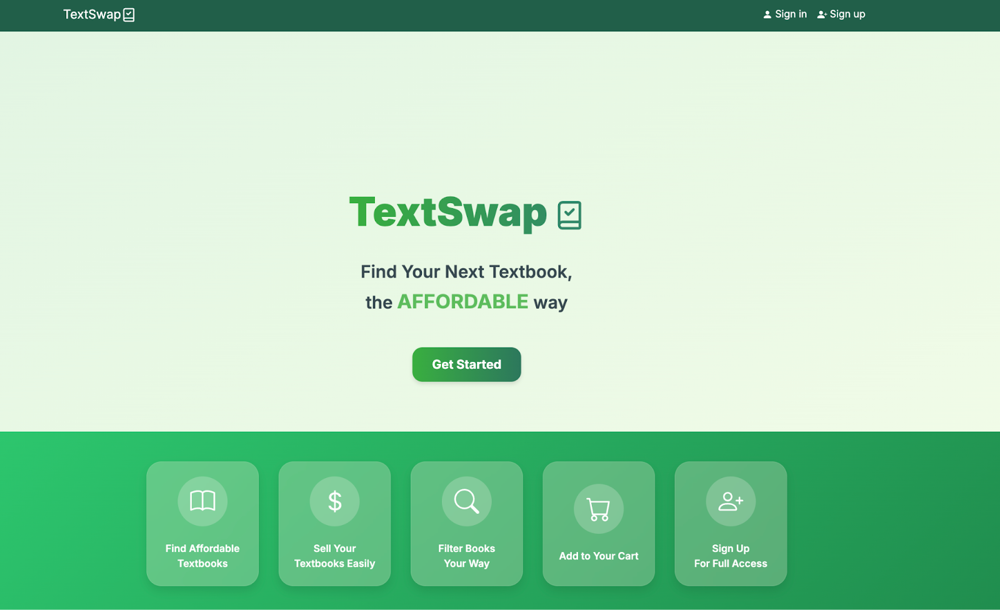

# **Project Name: Manoa TextSwap**
### Creators: Ellie Ishii, Dhaniel Bolosan, Logan Teachout, and Xingyao He

 

# **Summary of Project**
Manoa TextSwap is a student-driven platform designed to simplify the buying and selling of secondhand textbooks within the UH Manoa community. By providing an intuitive and efficient marketplace, Manoa TextSwap makes acquiring course materials more affordable and accessible for students.

 

# **Role & What I learned**
In the Manoa TextSwap project, I played a pivotal role in developing the Buy page, which features all available textbooks accompanied by filters to help users efficiently locate the ones they need. I designed each textbook to be displayed as a card containing essential details and included a button for users to view more information when necessary. Beyond the Buy page, I also undertook the restyling of several key pages, including the List, Account, Sign Out, and Change Password pages, enhancing their visual appeal and user experience. Collaborating with Ellie, I established the foundational design for the login and sign-up pages, contributing to a smoother and more attractive interface. Additionally, I assisted Logan by creating accurate routing to the database for the Account page, ensuring seamless data management. Throughout this project, I expanded my expertise in various areas of web development, including different styling techniques, database connectivity and information storage, creating interactive buttons, and implementing precise routing mechanisms. This experience not only enhanced my technical skills but also provided me with a comprehensive understanding of the multifaceted process involved in building a functional and user-friendly website.

 

# **My Work: Buy Page & Restyling**

## **Log In/ Sign Up**

 

## **Change Password/ Sign Out**

## **Buy Page**

### Book Details

 

## **Account Page**

